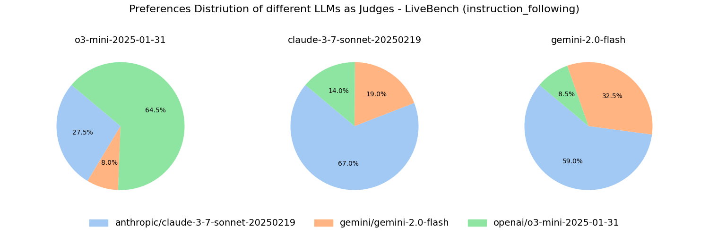
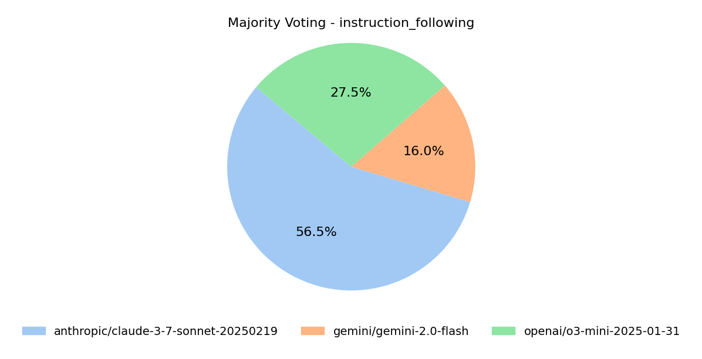
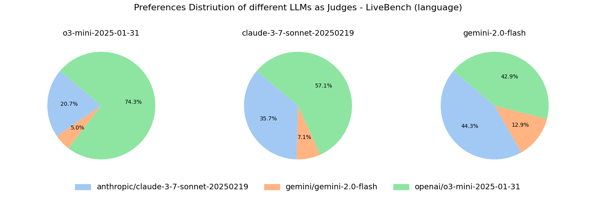
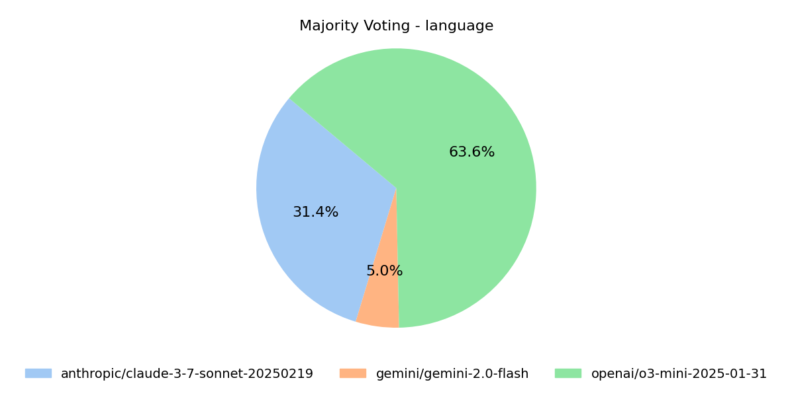
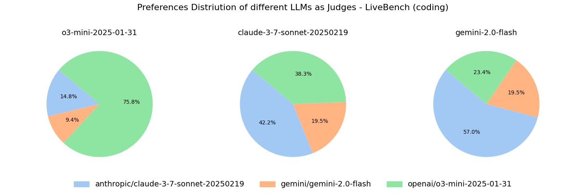
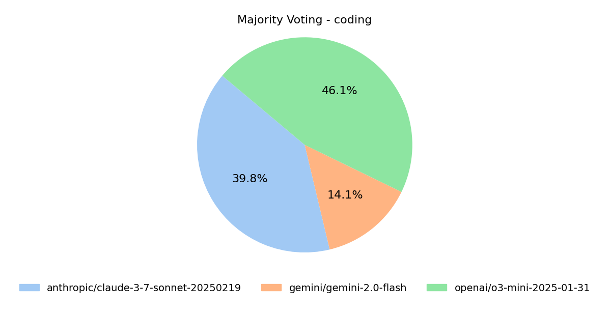
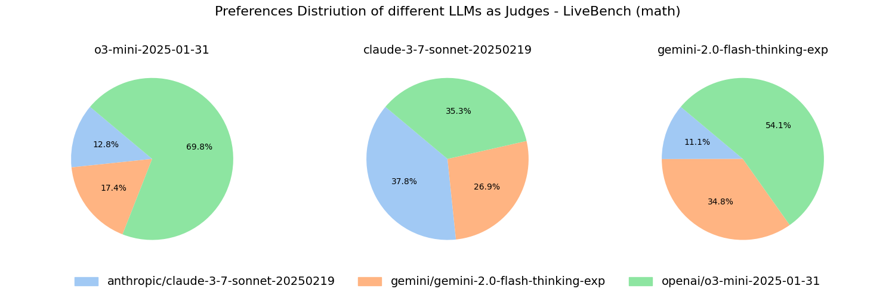
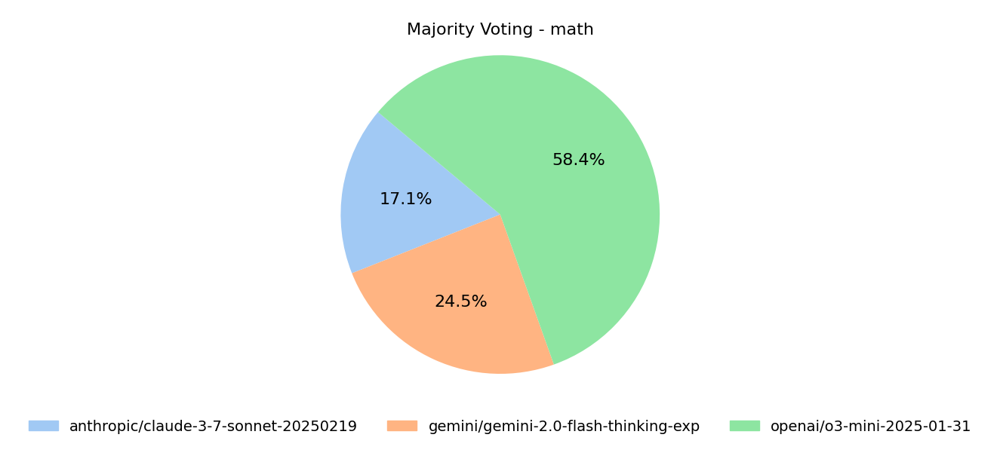
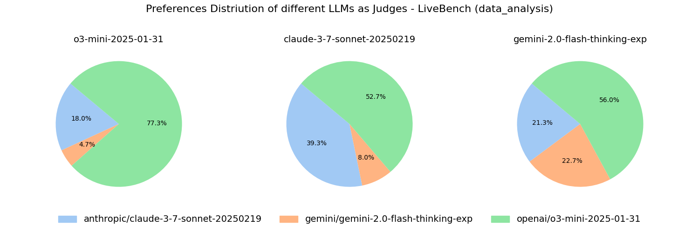
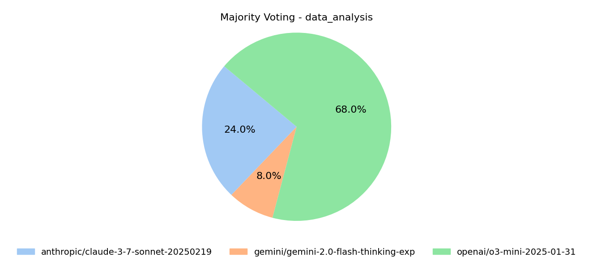

<!-- ## Self-bias in LLM as Judge
This repository implements a pipeline where the same large language models (LLMs) are used for both generating responses and evaluating (judging) those responses. The objective is to check if there's any self bias of using these models as judges.

**Models used**
We use the same models for response generation and judgement.
Livebench: We use `openai/o3-mini-2025-01-31` and `anthropic/claude-3-7-sonnet-20250219` for all 6 categories. We use `gemini/gemini-2.0-flash` for _instruction following_, _language_ and _coding_ and use `gemini/gemini-2.0-flash-thinking-exp` for _math_, _reasoning_ and _data analysis_ due to its enhanced capabilities in science and math.

Set the parameter `"llms"` in the `config.json` to the models you want to use to generate the responses for that particular dataset and task category.

**How to run**
```python3 main.py --dataset livebench --category math --start_index 200 --end_index 250```

**Note**
A few prompts are skipped due to timeout by `o3-mini`:
Livebench:
- reasoning : prompt 51
    - coding : prompt 53
    - math :  -->

    

# Self-bias in LLM as Judge

This repository implements a pipeline where the same large language models (LLMs) are used for both generating responses and evaluating (judging) those responses. The framework leverages the Livebench dataset across multiple task categories to assess model performance.

### Overview
#### Data Generation
We use `o3-mini`, `claude-3-7-sonnet` and `gemini-2.0-flash`. We swap `gemini-2.0-flash` with `gemini-2.0-flash-thinking-exp` for tasks such as reasoning, math etc. due to it's science and math abilities.

#### Judgement
We use two types of LLM Judge:
**1. Score Based:** The judge receives a prompt and a response (model agnostic). It's job is to assign a score to each of the criterion in the rubric. It returns the final score and the reasoning for this scoring. It uses the **scoring prompt** below.
**2.Preference Based:** The judge receives a prompt and multiple responses. It's job is to select the response it prefers the most using the rubric provided. It uses the **preference prompt** below.
Both the judges use the same rubric to evaluate.
##### RUBRIC:
> 1. **Instruction Following:** All prompt instructions and constraints are fully satisfied by the response.
> 2. **Relevance:** All information in the response is required by the prompt or adds helpful and enriching information relevant to the prompt. There is no entirely irrelevant information.
> 3. **Helpfulness:** The response contains sufficient detail and specificity to satisfy all parts of the prompt.
> 4. **Accuracy of Claims:** All facts that are objectively verifiable are correct, aligning with established facts or evidence.
> 5. **No Misleading Information:** All claims are appropriately contextualized where necessary, and opinions/controversial statements are not stated as fact.
> 6. **No Hallucinations:** All people, events, websites, articles, or institutions referenced in the response are real (not hallucinated).
> 7. **Numbers and Calculations:** All equations, dates, figures, and other numerical information is correct and presented accurately (with wording to indicate approximation if appropriate, and correct syntax).
> 8. **Readability:** The response is clear and easy to read.
> 9. **Language Mechanics:** The response has no grammar issues, typos, syntax errors, etc.
> 10. **Outline and Coherence:** The order and presentation of ideas are coherent and have a good flow.
> 11. **Concision:** The response efficiently communicates concepts and key points without being verbose.

##### SCORING PROMPT
> You are an impartial judge. You will receive a prompt and a response. Rate the response in the context of the prompt using this evaluation criteria: `<<rubric goes here>>` Assign 1 point for the response meeting each of the criteria, and 0 for not meeting them. Provide a brief justification of your scoring. Compute the overall score as a sum of individual scores. Return the Overall Score followed by the justification.

##### PREFERENCE PROMPT
> You are an impartial judge. You will receive a prompt and a set of responses makred as Response 1, Response 2, and so on. Choose the best response in the context of the prompt using this evaluation criteria: `<<rubric goes here>>`. Only return the best response number. For eg. if you think Response 2 is better than Response 1, only reply the number 2."

### Key Findings
**Livebench:**
- `o3-mini` shows a tendency for self-preference across all the categories, even when the other two models (including a tiebreaking judge of the openai lineage) think it’s not the best choice - eg. instruction following
- Across all the categories, the majority voting with tiebreaker reduces the percentage of `o3-mini` share, which again emphasises the potential self-bias tendency
- `gemini-2.0-flash` (or `gemini-2.0-flash-thinking-exp`) never considers itself the best in any of the tasks. In half of the tasks (instruction following, language, and reasoning) it prefers `claude-3-7-sonnet`, and for the other half o3-mini
- `claude-3-7-sonnet` is more neutral

<table>
  <tr>
    <th>Category</th>
    <th>Original Plot</th>
    <th>Majority Voting Plot</th>
  </tr>
  <tr>
    <td><strong>Instruction Following</strong></td>
    <td></td>
    <td></td>
  </tr>
  <tr>
    <td><strong>Language</strong></td>
    <td></td>
    <td></td>
  </tr>
  <tr>
    <td><strong>Coding</strong></td>
    <td></td>
    <td></td>
  </tr>
  <tr>
    <td><strong>Math</strong></td>
    <td></td>
    <td></td>
  </tr>
  <tr>
    <td><strong>Data Analysis</strong></td>
    <td></td>
    <td></td>
  </tr>
</table>

The per task plots can be found in `results/plots`

### Datasets Used

#### Livebench:
- **Instruction Following** - 200 prompts
- **Language** - 140 prompts
- **Coding** - 128 prompts
- **Math** - 368 prompts
- **Reasoning** - 149 prompts [Prompt 51 is skipped]
- **Data Analysis** - 150 prompts


### Models Used

#### Livebench Evaluation
For all six categories, the following models are employed:
- **OpenAI:** `openai/o3-mini-2025-01-31`
- **Anthropic:** `anthropic/claude-3-7-sonnet-20250219`
- **Gemini Models:** `gemini/gemini-2.0-flash` (For Instruction Following, Language, and Coding)
`gemini/gemini-2.0-flash-thinking-exp` (For Math, Reasoning, and Data Analysis due to its enhanced capabilities in science and math)
- **Tiebreaker Judge:** `openai/o1-preview`

> **Configuration Note:**  
> Set the `"llms"` parameter in the `config.json` file to specify the models you wish to use for generating responses and `"judges"` for the models you wish to use as judge for each dataset and task category.

### How to Run

To execute an experiment, run the following command in your terminal:

```
python3 main.py --dataset livebench --category math --start_index 200 --end_index 250 --respond True --Score True --Prefer True
```

You can adjust the parameters as needed:

- `--dataset`: Dataset key (default: livebench)
- `--category`: Task category (e.g., instruction_following, math, etc.)
- `--start_index`: The starting prompt index
- `--end_index`: The ending prompt index
- `--respond`: Flag to generate responses
- `--score`: Flag to generate scores
- `--prefer`: Flag to generate preferences